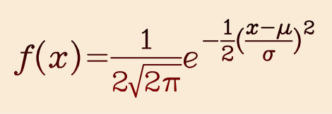
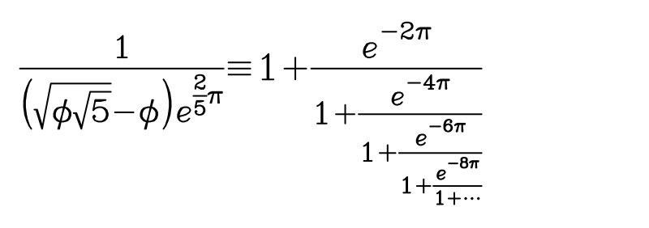
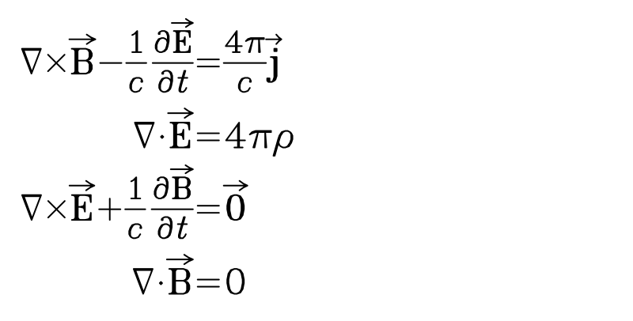
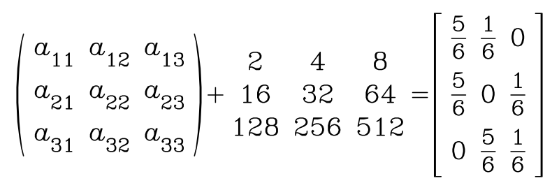
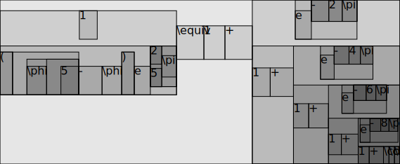
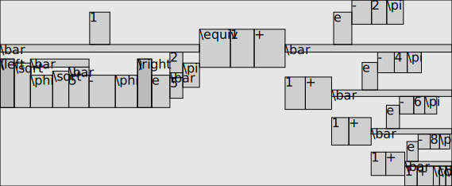
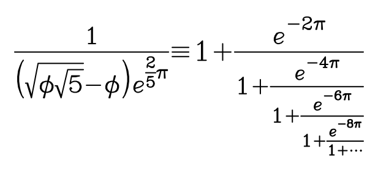

# hfmath

*Render LaTeX math with Hershey Fonts.*

[Download](./dist/hfmath.js) | [Try Online]() | [API](#usage)

hfmath is a tiny JS tool for rendering mathematics using single-line [Hershey Fonts](https://en.wikipedia.org/wiki/Hershey_fonts). ~140 KB script with no dependencies: LaTeX goes in, SVG paths comes out. No CSS. No font loading. Lightning fast. Works for browsers and servers. Customizable export for polyline data, SVG or PDF. Display math in your blog. Draw your homework with a plotter. Engrave your favorite equation on a plate. Animate.

For example:

```js
new hfmath(
  `f(x)=
    \\frac{1}{2\\sqrt{2\pi} }
    e^{-\\frac{1}{2}(\\frac{x-\\mu}{\\sigma})^2}`
).svg();
```

Yields an SVG containing a single `<path/>` element that looks something like this:


Give it some animation if you're feeling cheerful:



Supports nested fractions, nested square roots, and other gnarly math you might have:




As well as integrals, vectors, matrices, and aligned equations, just to name a few:






`\mathbf` `\mathfrac` etc. are mapped to the variety of fonts in Hershey:


Check out [more samples here](./samples).

For a list of supported LaTeX commands and symbols, check out [./src/symbols.ts](./src/symbols.ts) (There're about 200 of them). Note that the original Hershey font does not cover all math symbols available in LaTeX. Check out [./tools/sheet.svg](./tools/sheet.svg) for the full Hershey set. If you would like to have a new symbol manually added to hfmath, please feel free to open an Issue/PR!

hfmath is written from scratch, and probably does not match LaTeX visuals and behaviors perfectly (nor is it the goal). However, if something looks buggy or ugly, feel free to let me know in an Issue.

## Usage

Basics: render an equation and write SVG:

```js
//Import
const {hfmath} = require('./hfmath');

//Typeset a new equation
let eq = new hfmath("x^2 + 2x + 1");

//Write SVG
let svgStr = eq.svg();
fs.writeFileSync('out.svg',svgStr);
```

You can also obtain the raw polylines data:

```js
let eq = new hfmath("x^2 + 2x + 1");

let plines = eq.polylines();

console.log(polylines)
// [[[x0,y0],[x1,y1],...],...]
```

Or you can have it as the `d` attribute of an SVG `<path/>` element:

```js
let d = eq.pathd()

console.log(d)
//"M x y L x y ..."
```


Other possibilities include:

```js
// pdf
let pdfStr = eq.pdf();
fs.writeFileSync('out.pdf',pdfStr);

// bounding box for each symbol
let boxes = eq.boxes();
console.log(boxes)
//[{x,y,w,h},...]
```

Note that internally, hfmath uses the unit of `ex`, (approximately the height of a lower case "x"). The export functions have default settings to upscale by 16. You can fine-tune it by passing optional arguments to any export function, like so:

```js
let eq = new hfmath("x^2 + 2x + 1");
eq.svg({
  SCALE_X:32,
  SCALE_Y:32,
  MARGIN_X:16,
  MARGIN_Y:16,
  BG_COLOR:'antiquewhite',
});
```

All available options are:

```ts
interface ExportOpt{
  MIN_CHAR_H?:number;
  MAX_W?:number;
  MAX_H?:number;
  MARGIN_X?:number;
  MARGIN_Y?:number;
  SCALE_X?:number;
  SCALE_Y?:number;
  STROKE_W?:number;
  FG_COLOR?:string;
  BG_COLOR?:string;
}
```

## Advanced

You can tweak typesetting parameters such as line spacing, factor to downscale subscripts and superscripts, by modifying the `CONFIG` object. For example:

```js
let {CONFIG,hfmath} = require('./hfmath');

// make subscripts appear smaller
CONFIG.SUB_SUP_SCALE = 0.5;

// new setting now in place:
let eq = new hfmath("x^2");
```

All available options:

```ts
let CONFIG : Record<string,number> = {
  SUB_SUP_SCALE:0.75,
  SQRT_MAG_SCALE:0.5,
  FRAC_SCALE:0.85,
  LINE_SPACING:0.5,
  FRAC_SPACING:0.4,
}
```

## Algorithm

Upon given a LaTeX expression, hfmath first parses into tokens then into a syntax tree, and generate nested bounding boxes for each node:


Next, it flattens bounding boxes into an array of instructions for exactly where and at what size to draw each symbol:


Finally it transforms the Hershey font coordinates to draw the symbols:


The bounding boxes can be quite cool to look at for more complicated equations:






