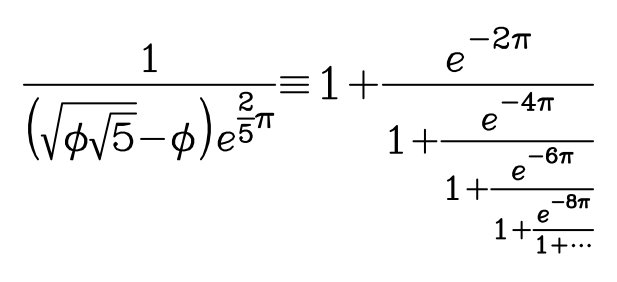

$$
y=x^2+2x+1
$$
$$
\int_0^\infty e^{-x}\,\mathrm{d}x
$$
$$
x=\frac{-b\pm\sqrt{b^2-4ac}}{2a}
$$
$$
\vec{x}=\vec{AB}+\vec{BC}=\vec{AC}
$$
$$
\hat{a}+\acute{b}+\grave{c}+\bar{d}+\tilde{e}+\underline{f}
$$
$$
\frac{\sin(\angle BAC)}{BC}=\frac{\sin(\angle ABC)}{AC}=\frac{\sin(\angle ACB)}{AB}
$$
$$
^3/_7+\frac{k(k+1)}{2}+k+1+\frac{\frac{1}{x}+\frac{1}{y}}{y-z}
$$
$$
\lim_{x \to \infty} \,\exp(-x) = 0, \quad \lim_{h \to 0} \,\frac{\sin(h)}{h} = 1
$$
$$
\cos (2\theta) = \cos^2 \theta - \sin^2 \theta
$$
$$
P\left(A=2\middle|\frac{A^2}{B}>4\right)
$$
$$
f(n) = \begin{cases}n/2&\text{if }n\text{ is even} \\ -(n+1)/2 & \text{if }n\text{ is odd}\end{cases}
$$
$$
f(x)=\frac{1}{2\sqrt{2\pi} }e^{-\frac{1}{2}(\frac{x-\mu}{\sigma})^2}
$$
$$
\frac{1}{\left(\sqrt{\phi \sqrt{5}}-\phi\right) e^{\frac 2 5 \pi}} \equiv 1+\frac{e^{-2\pi}} {1+\frac{e^{-4\pi}} {1+\frac{e^{-6\pi}} {1+\frac{e^{-8\pi}} {1+\cdot\cdot\cdot} } } }
$$
$$
\left( \sum_{k=1}^n a_k b_k \right)^2 \leq \left( \sum_{k=1}^n a_k^2 \right) \left( \sum_{k=1}^n b_k^2 \right)
$$
$$
\int u \frac{\rm{d}v}{\rm{d}x}\,\rm{d}x=uv-\int \frac{\rm{d}u}{\rm{d}x}v\,\rm{d}x
$$
$$
f(x) = \int_{-\infty}^\infty \hat f(\xi)e^{2 \pi i \xi x} 
$$
$$
\begin{aligned}
\nabla \times \vec{\mathbf{B}} - \frac 1 c \, \frac{\partial\vec{\mathbf{E}}}{\partial t} & = \frac{4\pi}{c}\vec{\mathbf{j}} \\
\nabla \cdot \vec{\mathbf{E}} & = 4 \pi \rho \\
\nabla \times \vec{\mathbf{E}} + \frac 1 c \, \frac{\partial\vec{\mathbf{B}}}{\partial t} & = \vec{\mathbf{0}} \\
\nabla \cdot \vec{\mathbf{B}} & = 0
\end{aligned}
$$
$$
\frac{n!}{k!(n-k)!} = ^n C_k = \binom{n}{k}
$$
$$
\begin{pmatrix}
a_{11} & a_{12} & a_{13}\\ 
a_{21} & a_{22} & a_{23}\\ 
a_{31} & a_{32} & a_{33}
\end{pmatrix}
+\,
\begin{matrix}
2 & 4 & 8 \\
16 & 32 & 64 \\
128 & 256 & 512
\end{matrix}
\,=
\begin{bmatrix}
       \frac{5}{6} & \frac{1}{6} & 0          \\ 
       \frac{5}{6} & 0           & \frac{1}{6}\\
       0           & \frac{5}{6} & \frac{1}{6}\\
     \end{bmatrix}
$$
$$
\mathcal L_{\mathcal T}(\vec{\lambda})
    = \sum_{(\mathbf{x},\mathbf{s})\in \mathcal T}
       \log P(\mathbf{s}\mid\mathbf{x}) - \sum_{i=1}^m
       \frac{\lambda_i^2}{2\sigma^2}
$$
$$
\sqrt[a]{b\sqrt[c]{d\sqrt[e]{f\sqrt[g]{h\sqrt[i]{j\sqrt[k]{l\sqrt[m]{n\sqrt[o]{p\sqrt[q]{r}}}}}}}}}
$$
$$
\ell_{arc}=2\pi r(\theta/360^\circ)
$$
$$
\begin{aligned}
a_{n} &=a_{n-1}+a_{n-2} \\
&=\frac{\left(\frac{1+\sqrt{5}}{2}\right)^{n-2}-\left(\frac{1-\sqrt{5}}{2}\right)^{n-2}+\left(\frac{1+\sqrt{5}}{2}\right)^{n-1}-\left(\frac{1-\sqrt{5}}{2}\right)^{n-1}}{\sqrt{5}} \\
&= \frac{\left(\frac{1+\sqrt{5}}{2}\right)^{n-2}\left(1+\frac{1+\sqrt{5}}{2}\right)-\left(\frac{1-\sqrt{5}}{2}\right)^{n-2}\left(1+\frac{1-\sqrt{5}}{2}\right)}{\sqrt{5}} \\
&= \frac{\left(\frac{1+\sqrt{5}}{2}\right)^{n-2}\left(\frac{1+\sqrt{5}}{2}\right)^{2}-\left(\frac{1-\sqrt{5}}{2}\right)^{n-2}\left(\frac{1-\sqrt{5}}{2}\right)^{2}}{\sqrt{5}} \\
&= \frac{\left(\frac{1+\sqrt{5}}{2}\right)^{n}-\left(\frac{1-\sqrt{5}}{2}\right)^{n}}{\sqrt{5}}
\end{aligned}
$$
$$
\frak{Sphinx}\;of\;\bf{Black}\;\mathcal{Quartz},\;\mathsf{Judge}\;\it{my}\;\rm{Vow}!
$$
$$
\Xi\varepsilon\sigma\kappa\varepsilon\pi\acute{\alpha}\zeta\omega\;\tau\eta\nu\;\psi\upsilon\chi\omicron\varphi\theta\acute{\omicron}\rho\alpha\;\beta\delta\varepsilon\lambda\upsilon\gamma\mu\acute{\iota}\alpha .
$$